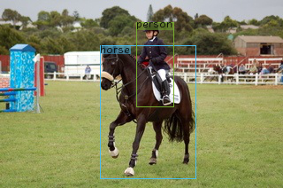
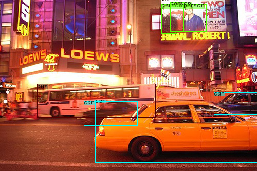
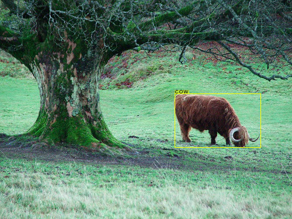
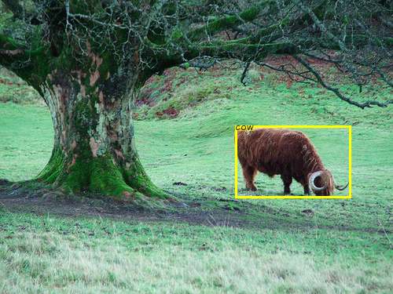
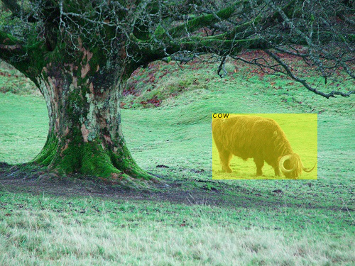

# BBox-Visualizer2

This is a python package for visualizing bounding boxes and adding labels to a given image. The creation of this package is inspired by [shoumikchow/bbox-visualizer](https://github.com/shoumikchow/bbox-visualizer), but I re-implement it through `Pillow` instead of `cv2`.

The format of a bounding box is `(xmin, ymin, xmax, ymax)`.

## Installation
### From `Pypi`
```
pip install bbox-visualizer2
```

### From source
```
git clone https://github.com/fansuregrin/bbox-visualizer2.git bbv2
cd bbv2
python3 -m pip install --upgrade build
python3 -m build
pip install dist/bbox_visualizer2-0.0.2-py3-none-any.whl
```

## Usage
You can see [demos](./demos/) for details.

### Multiple bboxes visualization





### Single bbox visualization

- Label on the top of the bbox



- Label inside the box



- Set the box to opaque

